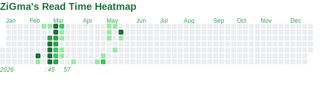

# 微信阅读热力图



通过 Agent API Gateway 获取微信读书每日阅读时长，自动生成 GitHub 贡献图风格的 SVG 热力图。

## 配色主题

通过 `--theme` 参数或 `THEME_COLOR` 环境变量选择主题：

| 主题 | 预览 | 说明 |
|------|------|------|
| `github` |  | GitHub 经典绿（默认） |
| `weread` |  | 微信读书蓝 |
| `warm` |  | 暖阳橙 |
| `purple` |  | 梦幻紫 |
| `ocean` |  | 海洋青 |
| `rose` |  | 玫瑰粉 |

```bash
# 蓝色主题
python heatmap.py --theme weread

# 紫色主题
THEME_COLOR=purple python heatmap.py --stats
```

## 快速开始

### 1. 获取 API Key

联系微信读书 Agent API 服务获取 `WEREAD_API_KEY`（格式 `wrk-xxxxxxxx`）

```bash
export WEREAD_API_KEY=wrk-xxxxxxxx
```

### 2. 本地运行

```bash
pip install -r requirements.txt
python heatmap.py
python heatmap.py --theme weread --start 2023 --end 2025 --stats
```

### 3. GitHub Actions 配置

> **必须设置 Secret，否则 Action 会失败。**

1. Fork 或克隆本项目到你的仓库
2. **Settings → Secrets and variables → Actions**
3. 添加 **Repository secret**：`WEREAD_API_KEY` = `wrk-xxxxxxxx`
4. （可选）添加 **Repository variable**：
   - `NAME` — 图表标题，默认"微信阅读热力图"
   - `THEME_COLOR` — 配色主题，默认 `github`
5. 进入 **Actions** → **Run workflow** 测试

## 配置选项

### CLI 参数

| 参数 | 默认值 | 说明 |
|------|--------|------|
| `--start` | 今年 | 起始年份 |
| `--end` | 今年 | 结束年份 |
| `--theme` | `github` | 配色主题 |
| `--output` | `heatmap.svg` | SVG 输出路径 |
| `--json` | 无 | 同时导出原始数据 JSON |
| `--stats` | false | 打印阅读统计摘要 |

### 环境变量

| 变量 | 默认值 | 说明 |
|------|--------|------|
| `WEREAD_API_KEY` | — | **必填**，API Key |
| `NAME` | 微信阅读热力图 | 图表标题 |
| `THEME_COLOR` | `github` | 配色主题名 |

## GitHub Actions

### 手动触发

1. **Actions** → **微信阅读热力图自动生成** → **Run workflow**
2. 可选填入 `start_year` / `end_year`

### gh CLI 触发

```bash
gh workflow run weread-heatmap.yml
gh workflow run weread-heatmap.yml -f start_year=2023 -f end_year=2025
gh run list --workflow=weread-heatmap.yml --limit=3
```

### 自动运行

每天 UTC 0:00（北京时间 8:00）自动触发。

## 文件说明

| 文件 | 说明 |
|------|------|
| `heatmap.py` | 主程序，数据获取 + SVG 生成 + CLI |
| `weread_auth.py` | 认证模块，Agent API Gateway |
| `.github/workflows/weread-heatmap.yml` | GitHub Actions 工作流 |
| `weread-skills/heatmap.md` | Skill 定义，供 Agent 调用 |
| `assets/` | 配色预览 SVG |

## FAQ

**如何换颜色？** — 设置 `THEME_COLOR` 变量，可选 `github`/`weread`/`warm`/`purple`/`ocean`/`rose`

**年份怎么改？** — 删除 GitHub Variables 中的 `START_YEAR`/`END_YEAR` 即使用当年，或手动触发时填入。

**Action 失败？** — 检查 `WEREAD_API_KEY` Secret，查看日志，或本地 `python heatmap.py` 排查。

## 许可证

MIT
